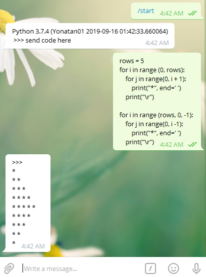

# Telegrampythoncompiler
Telegram bot for executing python code snippets. 
[pycompilerBot](https://t.me/pycompileBot)

## Installation
1. download project 
2. run `pip install -r requirements.txt`

## Usage
`python bot.py -t <TOKEN> -i <api_id> -q <api_hash>` to start bot

#### bot in action: just send your code and you get the output. Inline mode is also supported.
(I have blocked some imports and functions for security) 

